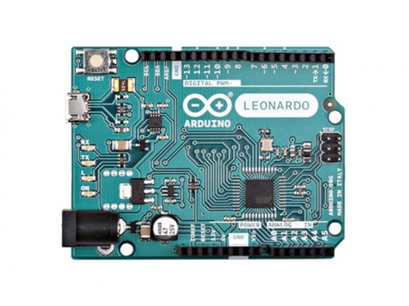
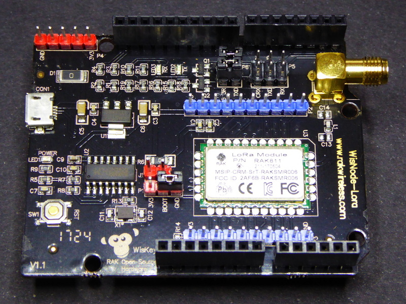
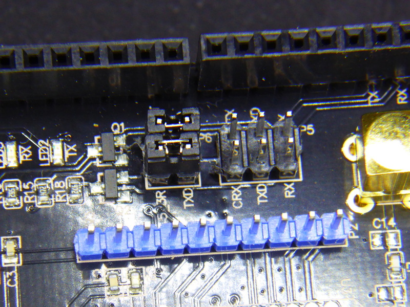

# RAK WisNode-LoRa downlink example

Downlink example using an Arduino Leonardo and RAK WisNode-LoRa shield.

This example uses RAK811 library (in the libs folder)
(https://github.com/RAKWireless/RAK811-AT-Command/tree/master/Arduino/RAK811)

## Hardware

Arduino Leonardo. The Leonardo uses two different hadware serial ports for the USB and the RX/TX lines in the header, this allows to have debug information via USB while driving the WisNode.

RAK WisNode-LoRa

Relay module

[Buy it from Aliexpress](http://s.click.aliexpress.com/e/qZfAq7M).

## Usage

1. Connect the jumpers in the WisNode-LoRa shield like this:

1. Connect D13 in the header to a RELAY module. The sketch assumes the relay uses inverse logic because that's the one I have.

1. Copy the `credentials.sample.h` to `credentials.h` and edit it with proper values for your connection.

1. Flash the Leonardo. You can do it using PlatformIO just by `pio run -t upload` or use Arduino IDE. If you choose the later you will have to add the RAK811 library first.

1. The sketch sends the status of the relay every minute and checks the response to see if it has to change the state of the relay.

1. The node-red folder contains a flow you can use as a start-up point for your logic. It has the basic receive-send nodes plus 2 injectors to enqueue the status you wish to send to the node. Note that the status will be sent after a reception.

## License

Copyright (C) 2018 by Xose Pérez (@xoseperez)

This program is free software: you can redistribute it and/or modify
it under the terms of the GNU General Public License as published by
the Free Software Foundation, either version 3 of the License, or
(at your option) any later version.

This program is distributed in the hope that it will be useful,
but WITHOUT ANY WARRANTY; without even the implied warranty of
MERCHANTABILITY or FITNESS FOR A PARTICULAR PURPOSE.  See the
GNU General Public License for more details.

You should have received a copy of the GNU General Public License
along with this program.  If not, see <http://www.gnu.org/licenses/>.
